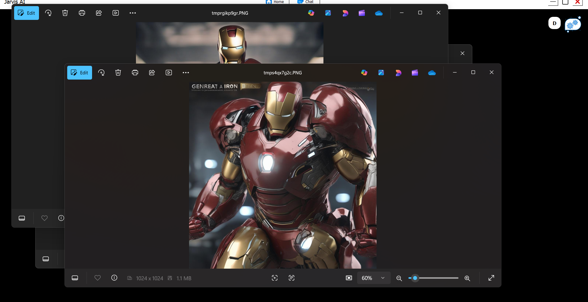
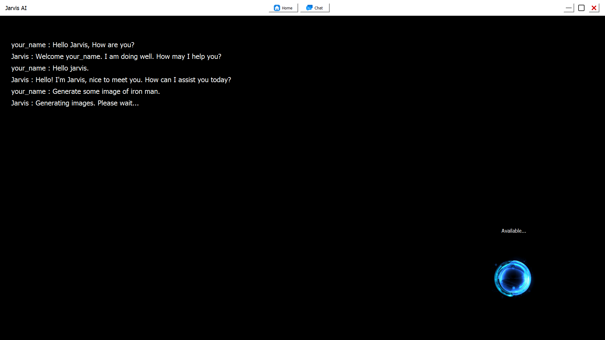

# Jarvis AI 🤖

## Description
Jarvis is an intelligent virtual assistant built using Python that automates everyday tasks and responds to voice or text commands. Inspired by the fictional AI from Iron Man, Jarvis integrates multiple functionalities, including:

- Web search
- Application control (open/close apps)
- Content generation (emails, code, documents)
- Voice interaction
- YouTube 
- system commands
- Image generation

The assistant leverages AI models for **natural language processing**, **speech recognition**, and **task execution**, making it a versatile productivity tool.

---

## Output






---

## Installation

1. Clone the repository:
```bash
git clone https://github.com/yourusername/Jarvis-AI.git
cd Jarvis-AI
